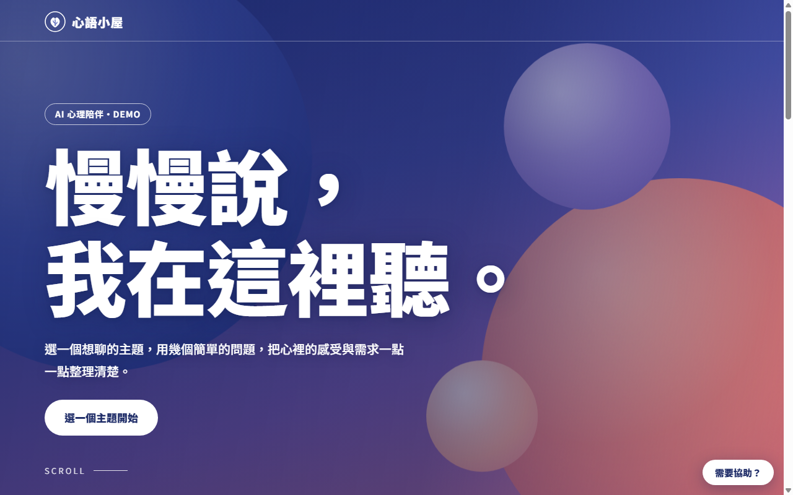
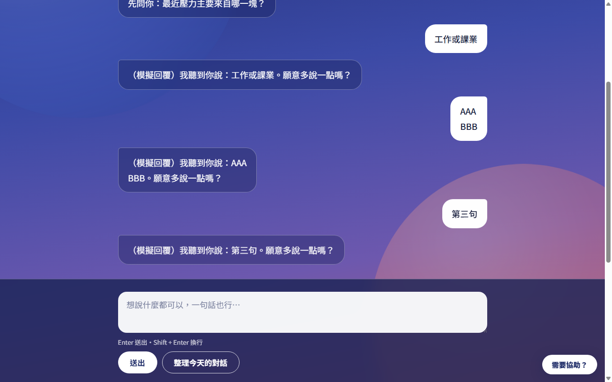
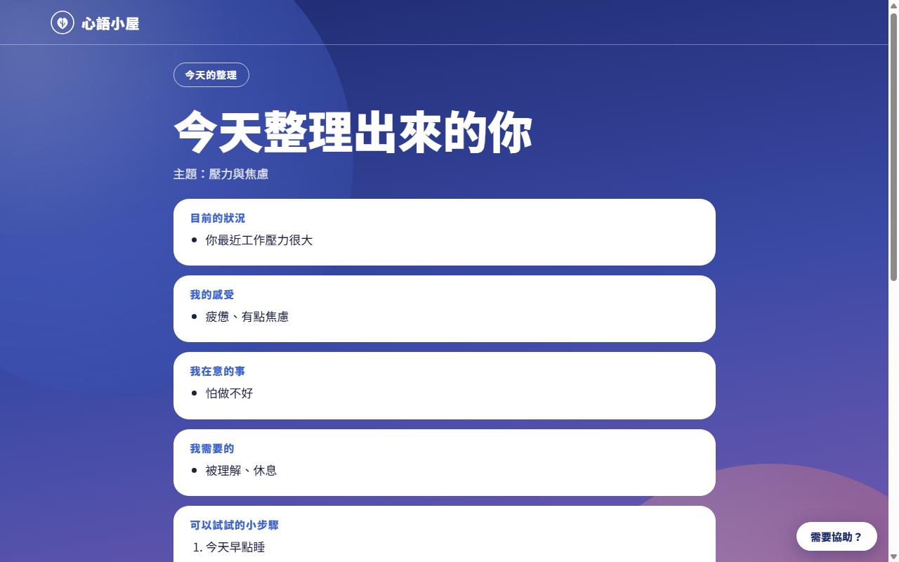
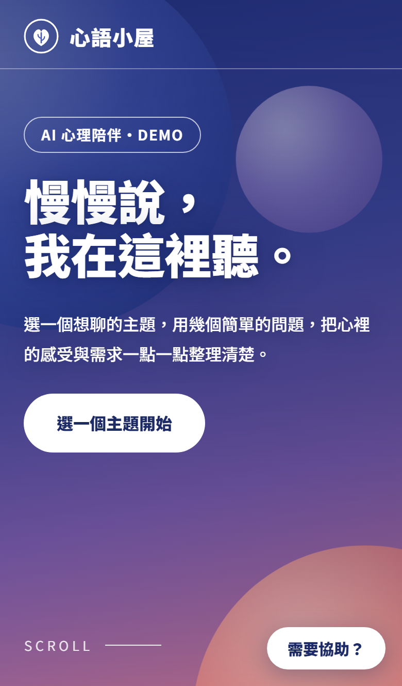
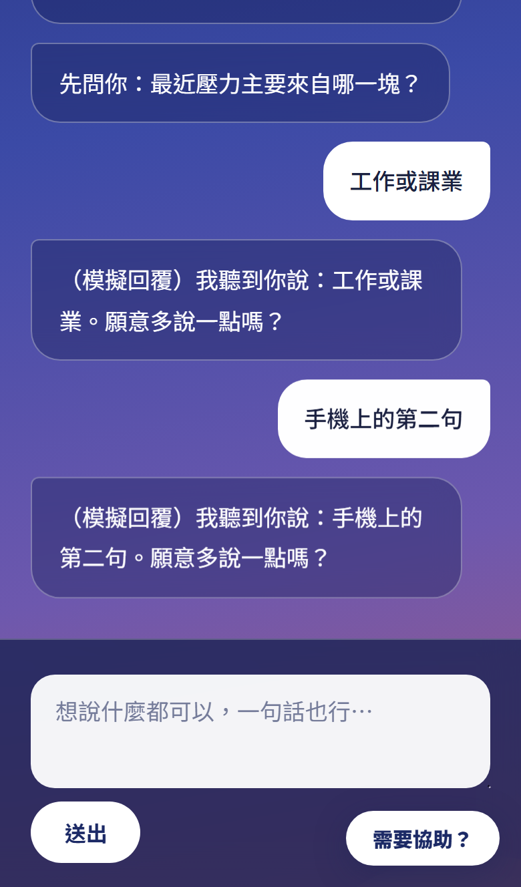

# 心語小屋・AI 心理陪伴（DEMO）

一個安靜的地方：選一個想聊的主題，用對話慢慢把心裡的感受與需求整理清楚。

**線上 DEMO：<https://sibyl0628-collab.github.io/1003/>**

> 這是**自我整理工具**，不是醫療或專業心理諮商，也無法做診斷。
> 這是展示用的 DEMO：AI 模式下，輸入內容會送到 Google Gemini 免費版（Google 可能用於改進產品，也可能有人工審閱），請**用虛構情境體驗，不要輸入真實隱私**。

## 畫面

| 首頁 | 對話 | 整理出來的你 |
|---|---|---|
|  |  |  |

手機版：

| 首頁 | 對話 |
|---|---|
|  |  |

## 功能

- **4 個主題**：壓力與焦慮、人際與親密關係、情緒低落與自我價值、決策與人生方向
- **AI 即時對話**（Gemini）：先同理、再問一個問題；聊滿 3 句後可「整理今天的對話」，整理後還能回來繼續聊
- **腳本式引導問答**：不使用 AI 的備援模式，AI 額度用完或出錯時會自動切換
- **安全設計**
  - 偵測到輕生等字眼時，立刻跳出專線，並回覆固定的關懷訊息（不交給 AI 自由發揮）
  - 每個畫面都有「需要協助？」按鈕；專線可依地區切換
  - 聊太久會溫和提醒休息，也提醒找身邊的人
- **沉浸式版面**：滿版漸層、捲動視差、手機與電腦皆可用，並通過 axe-core 無障礙檢查與文字對比度量測

## 架構

```
瀏覽器（純靜態 HTML/CSS/JS，放在 GitHub Pages）
   │  只呼叫中轉 Worker，不含任何 API Key
   ▼
Cloudflare Worker（保管 Gemini API Key、系統提示詞、危機處理、來源網站限制）
   ▼
Google Gemini API
```

- `index.html`、`css/`、`js/`、`images/`：網站本體
- `js/scripts.js`：腳本式對話與專線資料（想改內容只動這支）
- `js/config.js`：只有 Worker 網址一行；留空就只用腳本式問答
- Worker 與測試在專案的另一個資料夾（`ai-counselor-worker/`、`tests/`），不在這個 repo

## 更新網站時
改完檔案後，把 `index.html` 裡 CSS／JS 網址的 `?v=` 數字加 1，上傳後瀏覽器就會立刻拿到新版，不會吃舊暫存。
